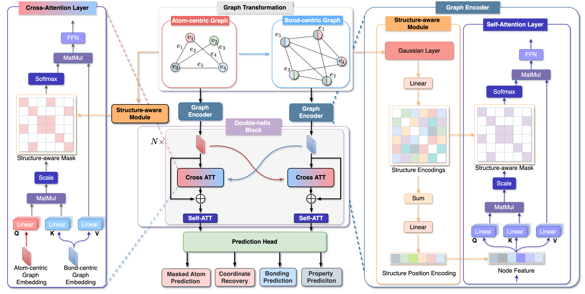

# DeMol
This repository is the official implementation of “Enhancing Molecular Property Predictions by Learning from Bond Modelling and Interactions”.


## Installation
- Clone this repository
>  git clone 

- Install the dependencies
```shell
cd ./demol
conda env create -f requirement.yaml
conda activate demol
pip install torch==1.7.1+cu110 torchvision==0.8.2+cu110 torchaudio==0.7.2 -f https://download.pytorch.org/whl/torch_stable.html
pip install torch_geometric==1.6.3
pip install torch_scatter==2.0.7
pip install torch_sparse==0.6.9
pip install azureml-defaults
pip install rdkit-pypi cython
python setup.py build_ext --inplace
python setup_cython.py build_ext --inplace
pip install -e .
pip install --upgrade protobuf==3.20.1
pip install --upgrade tensorboard==2.9.1
pip install --upgrade tensorboardX==2.5.1
```

## Datasets

- Preprocessed data: [download link](https://1drv.ms/u/s!AgZyC7AzHtDBeIDqE61u1ZEMv_8?e=3g428e)
  ```shell
  # create paths to datasets for evaluation/training
  
  # download the above compressed datasets (pcqm4mv2-pos.zip) to ./
  unzip pcqm4mv2-pos.zip -d ./datasets
  ```
  - You can also directly execute the evaluation/training code to process data from scratch.

## Evaluation

```shell
export data_path='./datasets/pcq-pos'                # path to data
export save_path='./logs/{folder_to_checkpoints}'    # path to checkpoints, e.g., ./logs/demol

export layers=12                                     # set layers=18 for 18-layer model
export hidden_size=768                               # dimension of hidden layers
export ffn_size=768                                  # dimension of feed-forward layers
export num_head=32                                   # number of attention heads
export num_3d_bias_kernel=128                        # number of Gaussian Basis kernels
export batch_size=256                                # batch size for a single gpu
export dataset_name="PCQM4M-LSC-V2-3D"				   
export add_3d="true"
bash evaluate.sh
```

## Training

```shell
export data_path='./datasets/pcq-pos'               # path to data
export save_path='./logs/'                          # path to logs

export lr=2e-4                                      # peak learning rate
export warmup_steps=150000                          # warmup steps
export total_steps=1500000                          # total steps
export layers=12                                    # set layers=18 for 18-layer model
export hidden_size=768                              # dimension of hidden layers
export ffn_size=768                                 # dimension of feed-forward layers
export num_head=32                                  # number of attention heads
export batch_size=256                               # batch size for a single gpu
export dropout=0.0
export act_dropout=0.1
export attn_dropout=0.1
export weight_decay=0.0
export droppath_prob=0.1                            # probability of stochastic depth
export noise_scale=0.2                              # noise scale
export dataset_name="PCQM4M-LSC-V2-3D"
export add_3d="true"
export num_3d_bias_kernel=128                       # number of Gaussian Basis kernels
bash train.sh
```

Our model is trained on 8 NVIDIA Tesla A6000 GPUs (48GB). 

## Downstream Task -- (QM9)
Download the checkpoint: qm9.pt
```shell
export ckpt_path='./qm9.pt'                # path to checkpoints
bash finetune_qm9.sh
```

## Downstream Task -- (OC20 IS2RE)
Download the checkpoint: oc20.pt
```shell
export ckpt_path='./oc20.pt'                # path to checkpoints
bash finetune_oc20.sh
```

## Downstream Task -- (MoleculeNet)
```shell
python finetune.py --model_file INPUT_MODEL_PATH --dataset DOWNSTREAM_DATASET --filename OUTPUT_FILE_PATH
```


